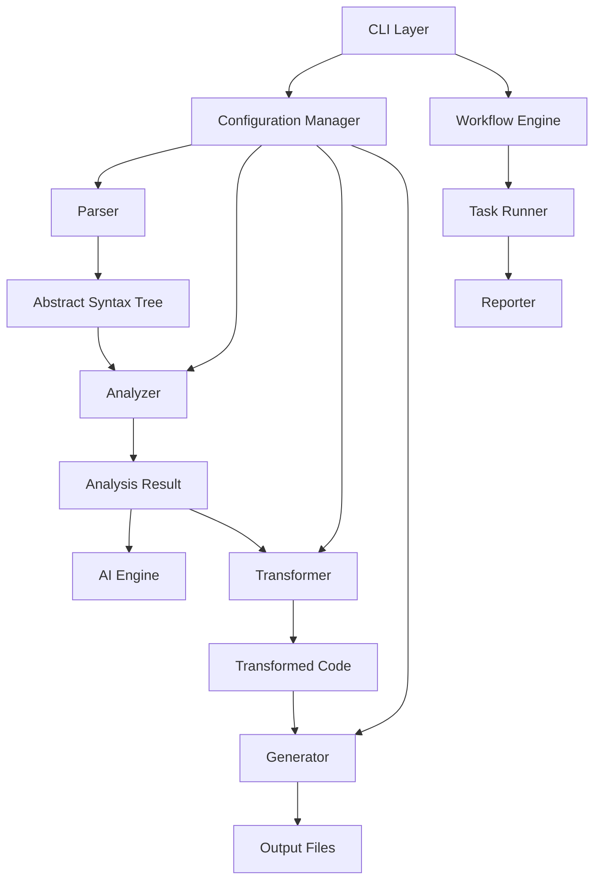

# Architecture

Solo Build is designed with a modular architecture that leverages industry-leading open-source tools to provide a powerful and flexible build system for JavaScript and TypeScript projects.

## Core Architecture

The Solo Build system is built around several key components that work together to analyze, optimize, and build your code:

## Technology Stack

Solo Build is built on top of several powerful open-source technologies:

### UnJS Ecosystem

  
  

    <h4 class="font-semibold">UnJS</h4>
    
A collection of JavaScript/TypeScript libraries designed for high-performance and developer-friendly experiences.

  

The UnJS ecosystem provides the foundation for Solo Build, offering a cohesive set of tools that work seamlessly together. Key UnJS packages used in Solo Build include:

### Citty

  
  

    <h4 class="font-semibold">Citty</h4>
    
A lightweight and powerful CLI framework for building command-line applications.

  

Citty powers Solo Build's command-line interface, providing:

- Command registration and parsing
- Help documentation generation
- Argument validation
- Interactive prompts

### Consola

  
  

    <h4 class="font-semibold">Consola</h4>
    
An elegant console logger for Node.js and browser applications.

  

Consola is used throughout Solo Build for logging and reporting, offering:

- Consistent and beautiful output formatting
- Log level management
- Error reporting with stack traces
- Progress bars and spinners

### Defu

  
  

    <h4 class="font-semibold">Defu</h4>
    
A utility for recursively merging default and user-provided configuration objects.

  

Defu handles configuration merging in Solo Build, ensuring that:

- User configurations are properly merged with defaults
- Arrays and objects are handled correctly
- Custom merging strategies can be applied when needed

### pkg-types

  
  

    <h4 class="font-semibold">pkg-types</h4>
    
Utilities for working with package.json files and Node.js packages.

  

pkg-types helps Solo Build with:

- Finding and reading package.json files
- Resolving package paths and entry points
- Detecting package types (ESM, CommonJS)
- Managing dependencies

### oxc

  
  

    <h4 class="font-semibold">oxc</h4>
    
A JavaScript parser written in Rust, providing high-performance code analysis.

  

oxc is used as one of Solo Build's parsing engines, offering:

- Extremely fast JavaScript/TypeScript parsing
- Low memory usage
- Accurate AST generation
- Support for the latest ECMAScript features

## Component Interactions

### Configuration Flow

1. User provides configuration via `solo-build.config.js` or CLI arguments
2. Configuration is loaded and validated by the Configuration Manager
3. Default values are merged with user configuration using Defu
4. Resolved configuration is passed to all components

### Build Process Flow

1. CLI processes commands using Citty
2. Workflow Engine orchestrates the build process
3. Parser generates an AST from source files
4. Analyzer examines the AST for complexity, dependencies, and issues
5. AI Engine provides optimization suggestions (if enabled)
6. Transformer applies optimizations to the code
7. Generator outputs the optimized code and reports
8. Reporter provides feedback to the user via Consola

## Extensibility

Solo Build is designed to be extensible through plugins and custom configurations. The modular architecture allows for:

- Custom parsers for specialized language features
- Custom analyzers for project-specific metrics
- Custom transformers for specialized optimizations
- Custom generators for different output formats
- Custom workflows for specific build processes

## Performance Considerations

Solo Build is optimized for performance through:

- Parallel processing of files where possible
- Incremental builds that only process changed files
- Caching of intermediate results
- Use of high-performance Rust-based tools like oxc
- Lazy loading of components to minimize startup time

## Future Architecture

The Mashed Potato Studios team is continuously improving the architecture with plans for:

- Enhanced AI integration for more sophisticated code analysis
- Additional parsers and transformers for more languages and frameworks
- Distributed build capabilities for very large projects
- Cloud-based analysis and optimization services
- Enhanced visualization tools for code metrics and dependencies
